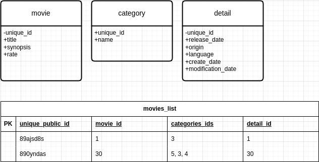

# Api de Filmes
Essa projeto de API pode parecer simples, mas o intuito é aprender a pensar em como fazer escolhas, arquitetar, escolhas de tecnologias, desenvolver técnicas e criar senso crítico em como iniciar um projeto de software, e não apenas utilizar uma tecnologia ou arquitetura só porque sim.

## Como foi projetado

O início do projeto começou pela identificação das entidade. Foi mapeado 3 tipos, são elas: *movie*, *category*, *detail*.

Inicialmente foi pensado em utilizar a clean architecture completa mas pelo escopo do projeto será mais reduzido.

### Entidades
Pretendia criar uma tabela chamada "*movies_list*" com identificadores (ID's) públicos, utilizando uuid e "linkando" as entidades utilizando os ids privados do sistema interno, (exceto as categorias) como mostra na imagem abaixo.

### Arquitetura (Software Architecture)

Comecei desenvolvendo em *clean architecture*, mas pelo escopo do projeto, a arquitetura seria muito mais aproveitada se fosse uma versão mais simplificada.

<!-- TODO: Explicar melhor sobre a simplificação da arquitetura... -->

### Tecnologias iniciais

