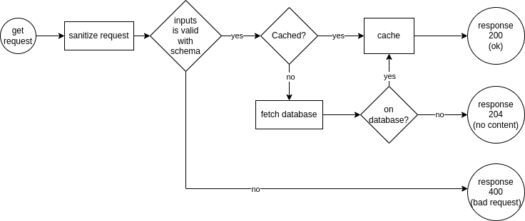
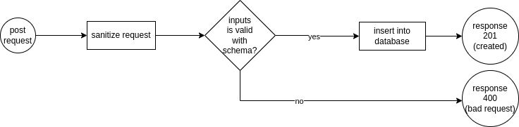
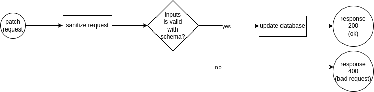

# Routes

## Movies

### GET

- /movies - List all movies.
- /movies/:id - Get all informations about a movie.

#### Flow Diagram

### POST

- /movies - Create a new movie register.

#### Flow Diagram

### PATCH

- /movies/:id - Update information about a movie.

#### Flow Diagram

### DELETE

- /movies/:id - Delete a movie "movie_list" table (soft delete).

#### Flow Diagram
